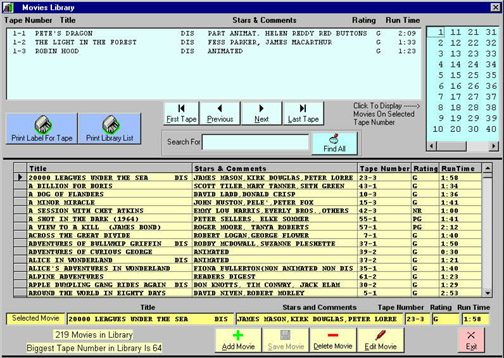



## aaMovies Library

### Description

Demonstrates many common VB controls, ADO databound controls, Datagrid, and input validation in a VHS movies library. Hopefully demonstrates good code style.
 
### More Info
 
Although this is probably an intermediate application, it is felt that the beginner could benefit from studying the code as well. I welcome your comments at suggestions as well as help in bettering my code.

             |
---                |---
**Submitted On**   |2002-03-20 14:51:00
**By**             |[Wayne L\. Braun](https://github.com/Planet-Source-Code/PSCIndex/blob/master/ByAuthor/wayne-l-braun.md)
**Level**          |Intermediate
**User Rating**    |4.7 (47 globes from 10 users)
**Compatibility**  |VB 6\.0
**Category**       |[Databases/ Data Access/ DAO/ ADO](https://github.com/Planet-Source-Code/PSCIndex/blob/master/ByCategory/databases-data-access-dao-ado__1-6.md)
**World**          |[Visual Basic](https://github.com/Planet-Source-Code/PSCIndex/blob/master/ByWorld/visual-basic.md)
**Archive File**   |[aaMovies\_L645433222002\.zip](https://github.com/Planet-Source-Code/wayne-l-braun-aamovies-library__1-32958/archive/master.zip)

